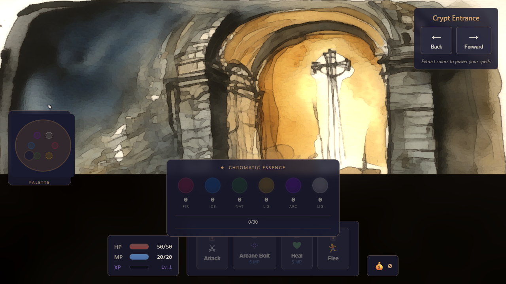

# AI Dungeon Master 3D

> A first-person watercolor dungeon crawler. Hand-painted backdrops, custom NPR shaders, turn-based combat, and a colour-extraction magic system.


[**Live demo →**](https://danfking.github.io/ai-dungeon-master-3d/)



## About this project

This game, like most of the others in my side-projects work, is an experiment in fully agentic generation. The interesting question for this one was specifically about *art*: could an agent drive the entire visual pipeline, from generating watercolour room backdrops in ComfyUI, through enemy sprites, through the GLSL post-processing chain that ties them together, and end up with something that looked like a coherent hand-painted dungeon? The answer turned out to be "almost." The iterations here are where I tried to close the gap.

So read this README in two layers. There's the game (turn-based combat, colour extraction, eleven enemies in a watercolour crypt) and the meta question (what does it take to get an agent to ship a *cohesive visual style*). The second is the harder problem.

## What it is

A 3D first-person dungeon crawler rendered in Three.js. You navigate room by room through the Undead Crypt, encounter enemies, and fight in turn-based combat. The twist on the combat layer is colour extraction: hovering the painted scene lets you pull pigment essences (fire, ice, nature, light, arcane, life) which then power your spells. The game logic is ported from a separate text-based ancestor project, [ai-dungeon-master](https://github.com/danfking/ai-dungeon-master) (not yet public), and the 3D layer is what's interesting here.

## Why I built it (the visual question)

I wanted to know whether an agent could deliver a *style*, not just isolated assets. Generating a single watercolour image is easy. Getting eleven enemy sprites, three rooms with four directional variants each, and a post-processing chain (Kuwahara filter, edge darkening, paper texture) to feel like they came from the same painter's hand was the test. Style coherence is the hard part of agent-driven art.

## How to run it

### In a browser (no build step)

```bash
git clone https://github.com/danfking/ai-dungeon-master-3d.git
cd ai-dungeon-master-3d/game
npx http-server . -p 8081 -c-1 --cors
```

Then open `http://localhost:8081`.

### As a desktop app (Electron)

```bash
npm install
npm start
```

## Controls

- **Mouse drag** — look around the scene
- **Hover** — extract colour essence from painted regions
- **1 / Click Attack** — basic attack
- **2 / Click Arcane Bolt** — costs 5 MP, requires WIS 8+
- **3 / Click Heal** — costs 5 MP, requires FAI 8+
- **4 / Click Flee** — escape combat

## Tech stack

- Three.js for 3D rendering
- Custom GLSL post-processing chain: Kuwahara (painterly), edge darkening (Sobel), unreal bloom (subtle glow), paper texture (grain + saturation reduction)
- Vanilla JS, no framework, ES modules where useful, IIFE globals for game logic
- Electron for the desktop wrapper
- ComfyUI (locally hosted) drove the watercolour asset pipeline. Configs and prompts live in `.agents/art-pipeline/` (gitignored, but the conventions are documented in [ARCHITECTURE.md](ARCHITECTURE.md))

## What this experiment showed about agentic generation

This is where the project earns its keep as a portfolio piece.

- **Style coherence is the unsolved problem.** Generating one good watercolour room is easy. Generating thirty-plus assets that look like they came from the same artist is not. The agent will happily produce a beautiful "watercolour dungeon entrance" and then, two prompts later, produce a "watercolour dungeon entrance" that's blue instead of warm. Closing this gap meant pinning down very specific style anchors (palette, brush size, paper texture, lighting direction) and re-prompting endlessly when an asset drifted.
- **NPR post-processing flattens drift.** A consistent post-processing chain (Kuwahara + edge darken + paper texture) papered over a lot of style inconsistency in source assets. This was the single most useful intervention: rather than try harder to make every source asset perfect, push them through a strong unifying filter at render time. Style transfer at the renderer rather than at generation time.
- **The agent could not evaluate "watercolour-ness".** Asking the agent "does this room look watercolour enough?" produced confident but useless answers. It could not reliably tell whether an output was off-style. Every meaningful direction came from me looking at the result and saying "more bleed, less saturation, smaller brush."
- **Directional variants are exponential.** Each room needs four directional views (north/south/east/west). Eleven rooms ≈ forty-four backdrops. Maintaining style across a single room's four variants was harder than across different rooms, because the eye notices inconsistency between adjacent views immediately.
- **Pipeline is more durable than prompts.** The prompts I ended up with are not the interesting artefact. The pipeline (ComfyUI configs, post-processing chain, asset structure conventions) is what makes the project repeatable. If I came back to this in a year, I'd discard the prompts and keep the pipeline.

## Status and what's next

Playable proof of concept. Crypt Entrance, Ossuary, and Ritual Chamber rooms working. Full combat loop (attack, arcane bolt, heal, flee), HP/MP/XP, colour extraction, eleven enemies wired up. Not in active development. Ideas if I came back: more rooms, the boss fight, an inventory screen that fits the watercolour aesthetic.

## Architecture

See [ARCHITECTURE.md](ARCHITECTURE.md) for the render pipeline, combat flow, asset pipeline conventions, and coding standards.

## License

MIT. See [LICENSE](LICENSE).
